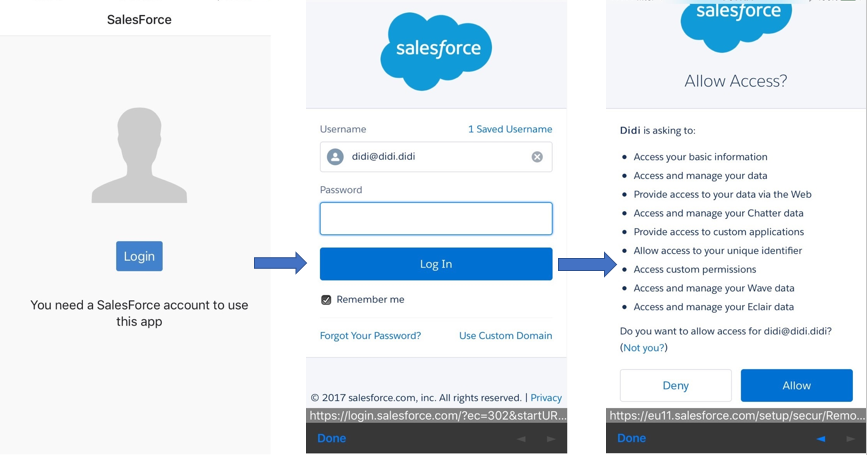

# Salesforce Contacts App

This app is developed by using [Onsen UI Framework](https://onsen.io/), [Monaca Cloud IDE](https://monaca.io/cloud.html) and [Salesforce Mobile SDK Development Guide](https://resources.docs.salesforce.com/sfdc/pdf/mobile_sdk.pdf).

## Contacts App

#### The Login panel of the app

#### Contacts pages

